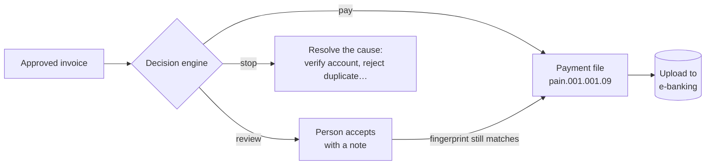

# Invoice Auto


**AI-powered invoice management for freelancers and SMEs operating across Spain and Switzerland.**

Upload a receipt photo or PDF → Claude extracts every field → review and approve in seconds →
**decide which approved invoices are safe to pay** and generate the ISO 20022 payment file for your e-banking.

**Live:** https://invoice-auto-xi.vercel.app · **Payment engine demo (no sign-up):** https://invoice-auto-xi.vercel.app/es/demo/payments

---

## Architecture

```
┌─────────────────────────────────────────────────────────────┐
│                        Client (Browser / PWA)               │
│  Next.js 16 App Router · React 19 · Tailwind v4             │
│                                                             │
│  ScanTicketButton ──► supabase.storage.from('invoices')     │
│         │                        │                          │
│         ▼                        ▼                          │
│  createInvoiceRecord()    Supabase Storage                  │
│  (Server Action)          (RLS: auth.uid() scoped)          │
│         │                                                   │
│         ▼                                                   │
│  analyzeReceipt()                                           │
│  (Server Action)                                            │
│         │                                                   │
│         ▼                                                   │
│  Anthropic Claude API                                       │
│  (claude-opus-4-6 + Zod structured output)                  │
│         │                                                   │
│         ▼                                                   │
│  public.invoices (Postgres · RLS · cents · UTC)             │
└─────────────────────────────────────────────────────────────┘
                              │
               ┌──────────────┴──────────────┐
               │                             │
          Vercel Edge                   Supabase
        (i18n middleware)         (Postgres + Auth + Storage)
```

---

## Tech Stack

| Layer | Technology | Notes |
|-------|-----------|-------|
| Framework | Next.js 16 (App Router) | Turbopack, RSC-first |
| Language | TypeScript 5 strict | `noUncheckedIndexedAccess` |
| Styling | Tailwind CSS v4 | Dark-mode first, JIT purge |
| Backend | Supabase | Postgres 15, Row Level Security |
| Auth | Supabase Auth | SSR cookies via `@supabase/ssr` |
| Storage | Supabase Storage | Private `invoices` bucket, signed URLs |
| AI | Claude API (`claude-sonnet-4-6`) | Vision + forced tool use (structured output) |
| Validation | Zod 3 | Server-side only, before any DB write |
| i18n | next-intl | Locales: `es` (default), `de`, `en` |
| Deployment | Vercel | Edge middleware, auto-preview deploys |
| PWA | Custom SW | Cache-first static, network-first nav |
| Payments | ISO 20022 pain.001.001.09 | SEPA (EPC) + Swiss SPS, validated against the official XSD |
| Tests | Vitest + PGlite | Pure domain + every migration replayed on in-memory Postgres |

---

## Advanced Engineering Decisions

### 1. Monetary amounts in integer cents
All prices (`subtotal_cents`, `tax_cents`, `total_cents`) are stored as `INTEGER` in Postgres.
Floating-point arithmetic on currency values causes rounding errors that compound across reports. Integer cents are exact, sortable, and trivially serialisable to every locale via `Intl.NumberFormat`.

### 2. Row Level Security on every surface
Both the `invoices` Postgres table and the `invoices` Storage bucket enforce `auth.uid()` policies at the database level. No application-layer filtering can accidentally expose another user's data — the database rejects the query before any row is returned.

```sql
-- Storage INSERT policy (bank-grade example)
create policy "invoices: owner upload"
  on storage.objects for insert to authenticated
  with check (
    bucket_id = 'invoices'
    and (storage.foldername(name))[1] = auth.uid()::text
  );
```

### 3. Zod validation before every DB write
Every data path that writes to Postgres is guarded by a Zod schema (`src/lib/validations/invoice.ts`).
This prevents corrupt AI output, malformed API payloads, and type drift between the DB schema and TypeScript types from ever reaching the database.

### 4. Server Components by default
All data fetching happens in React Server Components directly against the Supabase server client. Zero client-side secrets, zero waterfall round-trips, zero `useEffect` data fetching.

### 5. Structured logging for Vercel
`src/lib/logger.ts` emits newline-delimited JSON in production — compatible with Vercel Log Drains, Datadog, and Logtail. Every AI call and Storage operation is tagged and traceable.

---

## Payment decision engine

An approved invoice is a *correct* invoice. It is not yet a *safe payment*: the costly failures in accounts payable — paying twice, paying a changed IBAN that arrived in a forged email, paying an amount nobody looked at — happen after approval. The **Payments** section answers, for every approved invoice, *can this be paid right now?*



| Outcome | Rules |
|---|---|
| **stop** — resolved, never waived | no / unverified / rejected supplier account · changed IBAN still in cooling-off · IBAN printed on the invoice ≠ verified IBAN (BEC) · exact duplicate · QR-IBAN without QR reference (or the reverse) · unsupported route · not approved |
| **review** — accepted with a note | probable duplicate · amount ≥ four-eyes threshold · amount > 3× the supplier's median · supplier identified by name only |
| **pay** | SEPA (EUR) or Swiss domestic (CHF / QR-bill), execution on the due date or the business day before |

Design decisions (details in [ADR-002](docs/adr/ADR-002-payment-decision-layer.md), threats in [the threat model](docs/threat-model-payments.md)):

- **Pure engine** (`src/lib/payments/decision.ts`): no clock, database or network — same input, same decision, every reason with its evidence.
- **The database re-checks what must never be wrong.** The client can only *read* `pay_*` tables; every change goes through a `SECURITY DEFINER` function that re-validates the invariant and writes the audit entry in the same transaction. A partial unique index makes paying an invoice twice impossible at the database level.
- **Out-of-band IBAN verification + cooling-off.** New or changed IBANs start unverified; a changed one also waits (default 72 h) after verification.
- **Accepted reviews are fingerprinted** (amount, IBAN, reference, reasons). Change any of them and the acceptance is void.
- **Append-only audit log** — UPDATE, DELETE and TRUNCATE are rejected by trigger; IBANs are stored masked.
- **No money movement.** The app produces the pain.001 file; the user uploads it to their bank. No bank credentials, no licence.

---

## Project Structure

```
src/
├── app/[locale]/           # Localised App Router pages
│   ├── (auth)/             # Login / Register
│   ├── (dashboard)/        # Dashboard, Invoices, Payments (queue, suppliers, files, audit, settings)
│   └── demo/payments/      # Public read-only demo of the payment engine
├── components/
│   ├── dashboard/          # ScanTicketButton, StatCard, Sidebar
│   ├── payments/           # Queue, supplier accounts, payment files, audit
│   └── ui/                 # Button, Input, Card primitives
├── lib/
│   ├── actions/            # Server Actions: invoices.ts, ai.ts, payments.ts
│   ├── payments/           # Decision engine, IBAN/QR, duplicates, pain.001 (pure, tested)
│   ├── supabase/           # client.ts, server.ts, builder.ts
│   ├── validations/        # invoice.ts (Zod schemas)
│   └── logger.ts           # Structured logger
├── types/
│   └── database.ts         # Supabase DB types (hand-authored)
└── middleware.ts            # i18n + auth session refresh

messages/                   # i18n: es.json, de.json, en.json
supabase/migrations/        # 001–007 core · 008 schema reconciliation (ADR-001) · 009 payments (ADR-002)
supabase/tests/             # Migration + RLS tests on PGlite, official pain.001 XSD fixture
docs/                       # ADRs, threat model
public/
├── manifest.json           # PWA manifest (maskable icons, shortcuts)
└── sw.js                   # Service Worker (cache-first / network-first)
```

---

## Fiscal Coverage

| Country | Tax | Validation |
|---------|-----|-----------|
| Spain | IVA 4% / 10% / 21% | NIF / CIF format |
| Switzerland | VAT 8.1% | UID `CHE-xxx.xxx.xxx` format |

---

## AI Roadmap

| Phase | Feature | Status |
|-------|---------|--------|
| 1 | Receipt OCR via Claude Vision | ✅ Live |
| 2 | Structured output with Zod validation | ✅ Live |
| 3 | Automatic NIF/UID verification against public registries | 🔜 Planned |
| 4 | Expense categorisation (travel, supplies, services…) | 🔜 Planned |
| 5 | Quarterly IVA summary export (Modelo 303) | 🔜 Planned |
| 6 | VeriFactu compliance layer (Spain 2025 mandate) | 🔜 Planned |
| 7 | Multi-currency reconciliation (EUR ↔ CHF) | 🔜 Planned |
| 8 | Payment decision engine + ISO 20022 pain.001 | ✅ Live |

---

## Getting Started

```bash
# 1. Install dependencies
npm install

# 2. Configure environment
cp .env.local.example .env.local
# → Fill in NEXT_PUBLIC_SUPABASE_URL, NEXT_PUBLIC_SUPABASE_ANON_KEY, ANTHROPIC_API_KEY

# 3. Apply DB migrations (Supabase SQL Editor or CLI)
supabase db push

# 4. Run development server
npm run dev

# Quality gate (typecheck + lint + tests + build) — run before every push
npm run verify
```

---

## Deployment

```bash
# Create private GitHub repo and push
gh repo create invoice-auto --private --source=. --remote=origin --push

# Vercel auto-deploys on push to main
# Add env vars in: Vercel Dashboard → Project → Settings → Environment Variables
```

---

*Built with Next.js 16, Supabase, and Claude API.*
